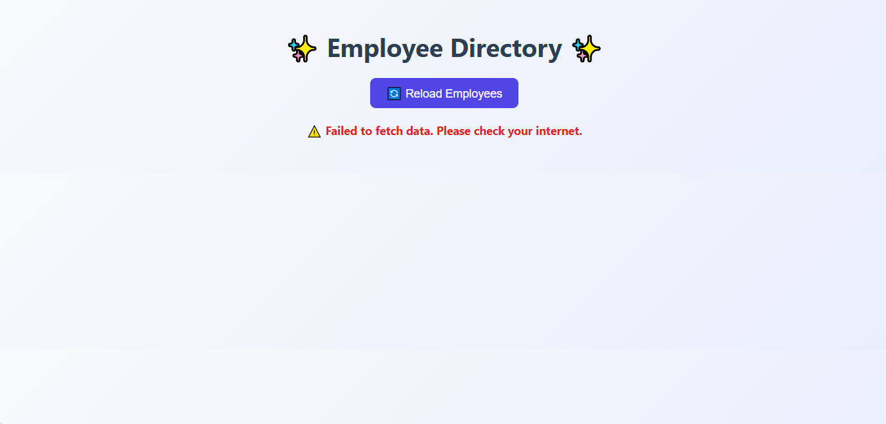
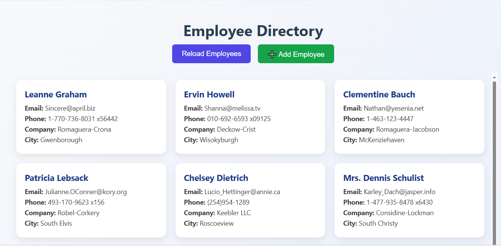

# 📋Employee Directory
  
The objective was to use the **JavaScript Fetch API** to retrieve data from a public API and display it in a styled Employee Directory.

---

## 🚀 Features
- Fetches employee data from **https://jsonplaceholder.typicode.com/users**
- Displays user info (Name, Email, Phone, Company, City) in **modern cards**
- **Reload Button** to refetch employee data
- **Error Handling** – shows a message if API fails (e.g., internet off)
- **Add Employee Form** (popup) to add custom employees
- Custom employees are saved in **localStorage** (persist after refresh)
- **Delete Button** for custom employees
- Responsive grid with scroll effect

---

## 🛠️ Technologies Used
- **HTML5**
- **CSS3 (Responsive Layout + Animations)**
- **JavaScript (Fetch API, Promises, localStorage)**

---

## 📸 Output Screenshots

### 🔹 Error State (API Failed / No Internet)


### 🔹 Working Employee Directory with Custom Add


---

## ▶️ How to Run
1. Clone this repository:
   ```bash
   git clone https://github.com/Aamir211/Employee-Directory.git
